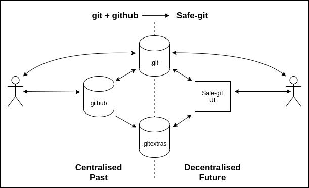
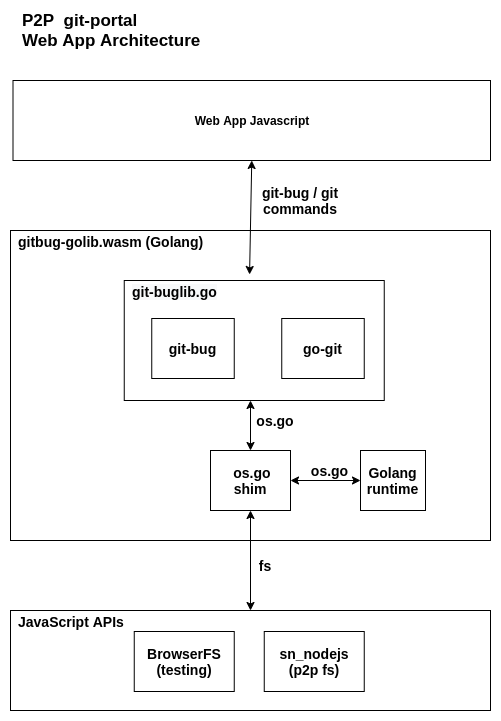

# A Decentralised Alternative to Github Type Services 

This project aims to provide an independent 'unhosted' git portal, and ultimately a full featured alternative to github and other third party code repository hosting services.

As far as I know this is the only git portal project which aims to work as a static web application, so an important goal is to show that this is possible, as well as providing a first fully p2p solution to the problem.

## STATUS:**
- [x] Proof of Concept using Svelte + Go/WASM based on git-bug ([p2p-git-portal-poc](https://github.com/happyborg/p2p-git-portal-poc))
- [ ] ACTIVE: Migrate to Svelte + Rust/WASI on WasmerJS ([p2p-git-portal-wasi](https://github.com/happybeing/p2p-git-portal-wasi)) - contributions welcome
# Vision - A P2P Git Portal on Safe Network
The essence is a github like web UI which runs locally, so not a federated or server side application, but one which runs in the browser as a static HTML web app.

The aim is to deliver a full github like experience based on Safe Network storage, or a similar p2p infrastructure. As a static HTML app it can be deployed on any storage which can serve HTML to a modern browser.

Though Safe Network is the focus of development, this project can easily be adapted to work on other peer-to-peer (p2p) storage systems such as IPFS or DAT, or deployed to cloud storage and even static web hosting.  The benefits of targeting Safe Network are many, but in short it is a fully encrypted secure, anonymous, decentralised storage and communications platform (see [safenetwork.tech](https://safenetwork.tech)).

Here's the diagram that kicked off this project on Sunday 19th October 2020 (after a couple of years thinking). This gives a flavour, but has been superseded with a proposed solution and architecture, see below. 

## github/gitlab/gitea like GUI
* operates on a local git repo
* includes git functionality
* adds issues tracking in local and remotes (and later pull requests)
* `git push/pull` remotes (e.g. on Safe via FUSE mounted Safe filesystem)
* web UI for public viewing of remotes, and issue creation (as static HTML hosted on Safe)
* ability for anyone to submit issues and comments via the web UI
* a native cross platform client for Windows, MacOS and Linux (e.g. using [Tauri](https://tauri.studio))
* a cross platform terminal UI for Windows, MacOS and Linux (e.g. using [git-bug](https://github.com/MichaelMure/git-bug))
 
# Discussions to Have

## Existing git UIs
There are many graphical, web and terminal UIs for `git`, so these may be adapted or learned from. 

Which should we look at and why? If you know any well, your input would be very helpful.

How can we build this? What libraries, tools and architecture can deliver this with minimal development effort. 

If we can show this working I'm confident it will attract more developer support and we can make improvements requiring more effort later.

## How To Discuss

You can open an issue to discuss something specific or join the more general discussion on the Safe Network forum topic: [Safe-git UI Discussion](https://safenetforum.org/t/safe-git-ui-discussion/32793?u=happybeing)

## Architectures and Implementation
I began researching ideas and have reviewed some existing approaches to providing support for issues tracking in `git` including [git-dit](https://github.com/neithernut/git-dit), and [SIT](https://github.com/sit-fyi/sit).

I have identified [git-bug](https://github.com/MichaelMure/git-bug) as the most promising way forward, but this is very early stage and there may be other libraries or tools which provide alternative approaches. So I'm interested to hear of other possibilities while I explore using `git-bug`.

## Architecture for Proof of Concept
I'm evaluating a solution based on using `git-bug` and `go-git` (both writing in Golang) as libraries compiled to wasm with a web font end to run in a modern web browser. Follow and contribute at [p2p-git-portal-poc](https://github.com/happybeing/p2p-git-portal-poc).

Here's the overall picture, which may change!

### Drawbacks of The First Proof of Concept
The first proof of concept was built using Golang/WASM in order to test the use of `git-bug`. The was very fast to develop, being functional in only a few weeks but using Go was never first choice. Rust would be my first choice for various reasons, but the 12MB runtime for Golang rules it out for a web app. In Rust the overhead is <200K.

So work now continues to replicate the functionality of the proof of concept, but using JavaScript and Rust to replace the functions performed by `git-bug`, `go-git` and `go-billy`. 
## Development Approach
Svelte has been selected for the front-end because it is very productive, performant and easy to learn. Even if you haven't used Svelte before I think you'll enjoy the experience and find it easy to contribute to front-end work.

Where possible business-logic will be compiled to WASM because this produces fast, compact code and allows us to develop in Rust which is productive, reduces scope for bugs and improves security.

To speed development we use existing libraries as much as possible, leaving the option to re-write or replace them later. For `git` functionality we may use JavaScript implementations in the short term, though will prefer Rust when suitable modules are available. Extensions for git issues, pull requests and additional business logic will be implemented in Rust.

To develop `git` functionality in a mixture of JavaScript and Rust we require a common filesystem in the browser. For this I evaluated Emscripten and WASI (Web Assembly System Interface) and selected the latter because it is well supported in Rust based on WasmerJS + `wasm-bindgen`. It will also I think be easier and generally more useful when migrating from the browser filesystem to a peer-to-peer filesystem for the production version.
# Contributions

Pull requests to enhance or add to this list are welcome but are accepted on the condition that they are licensed according to same terms as the LICENSE for software and other resources in this repository.

# LICENSE

The content of this repository is licensed under GPLv3 (for details see [./LICENSE](./LICENSE)) unless explicitly stated otherwise.
